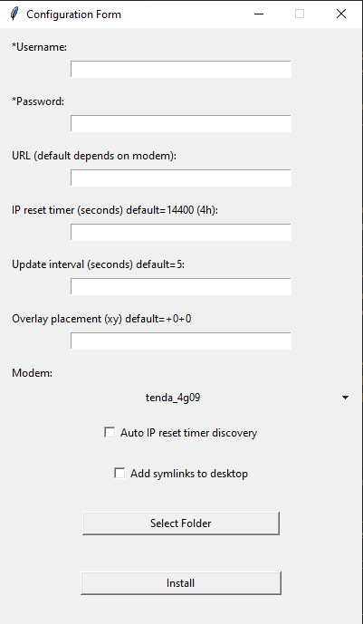

# IP_Timer

## What is it? 

IP_Timer is a python script that creates an overlay that tells you how many hours and minutes you have before your ISP changes your IP (thus interrupting your connection for a brief amount of time).

## WHY?

Some online games (e.g. Rainbow Six Siege) rely on your IP to let you reconnect to the server in case of crash (when your IP changes), so you may want to avoid queuing right before your IP changes. This script has also an IP resetting feature, that tells your modem to disconnect and reconnecto to internet, manually resetting your IP, thus resetting the time you have before it resets again.

## ⚠ WARNING / DISCLAIMER

- The current implementation only supports the LTE modem tenda_4g09, so, if you have a different modem, you must implement yourself the functions to retrieve connection time and to reset your connection.

- The autorun and services configuration is implemented for Windows only (currently). If you want to run it on Linux or MacOs, you must change the implementation based on the platform. In case of success, a pr would be well accepted.

- If you manage to create the implementation for your modem, please create the module inside the folder "modems", name it like your model and make a pr, it'll be well accepted.

- The password to access your modem's configuration page, will be stored in a config.ini file to be able to request informations about your connection time to your modem. If you are not ok with that, you can fork this project and implement a more secure way to store and retrieve the password without having it readable on the system. You may also try to make a pr if you manage to make a more secure implementation.

## Installation

Just run the install.py, it will prompt a request for UAC permissions, since it uses taskscheduler to run at boot.

The installation form looks like this:

- *Username: the username to login to your modem's configuration page;
- *Password: the password to login to your modem's configuration page;
- URL: the url to login to your modem's configuration page (usually http://192.168.0.1);
- IP reset timer: most ISPs have a 4 hours default IP lifetime. If you are unsure, check the "Auto IP reset timer discovery to let the script find your IP lifetime (on the first run, it will be 4H by default, so the timere could be incorrect).
- Update interval: how many seconds between each update of the timer overlay.
- Overlay placement: +0+0 will be the top left corner of your screen. The values are pixels, so if you have, for example, another monitor on the left of your main monitor, to place the overlay on its top left corner, you must insert -1920+0 (assumin your resolution is 1080x1920).
- Modem: choose your modem model. If it's not present, you must implement it yourself reverse engineering your modem configuration page.
- Add symlinks to desktop: it will add two symlinks, one to toggle the overlay, another one to reset your IP.
- Select folder, will select your installation folder (where IP_Timer folder will be created).
- Install: will perform the installation.
- "*" Fields are mandatory.

## License

[MIT](https://choosealicense.com/licenses/mit/)